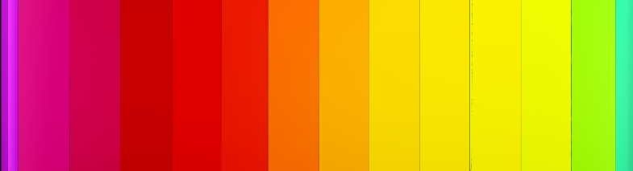
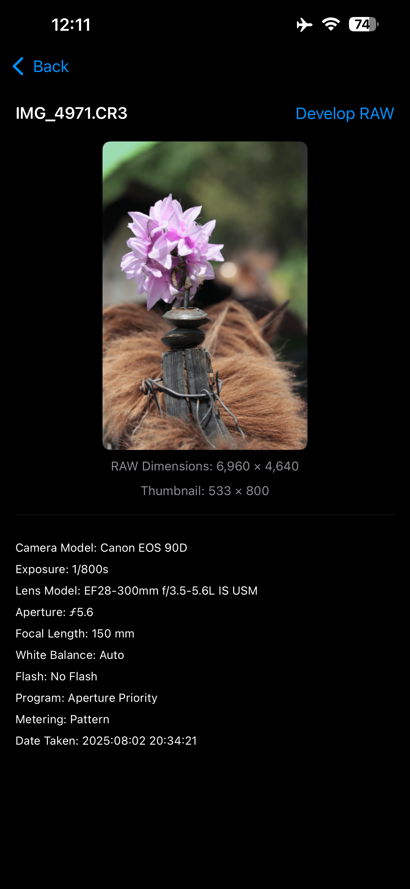
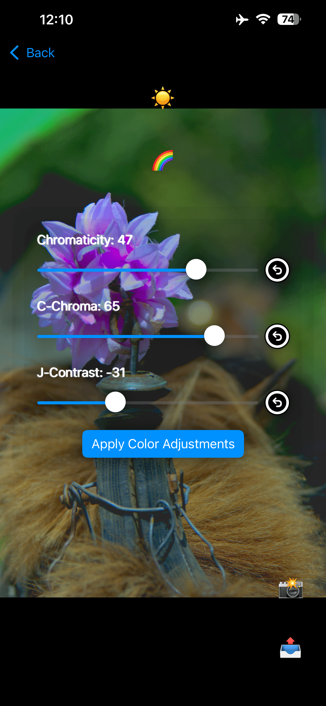
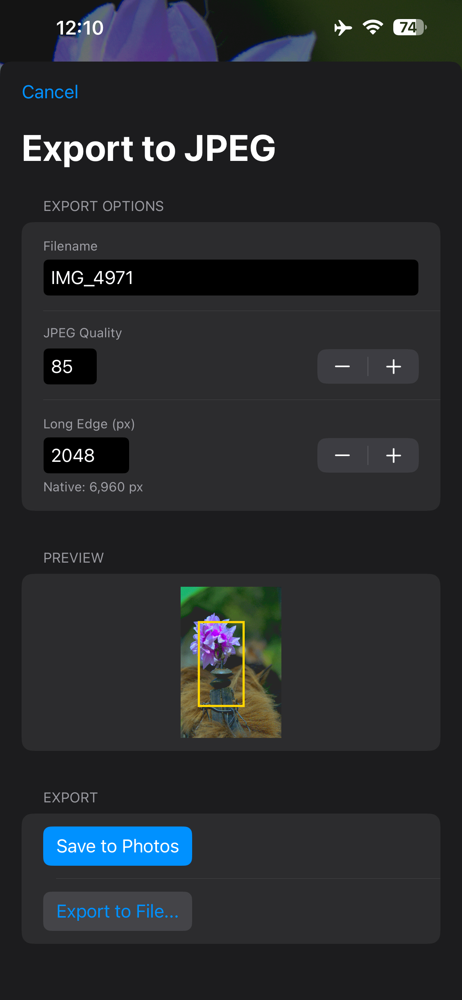

# RAWUnravel
</img>
**RAWUnravel** is an open-source RAW image viewer and minimal editor for iOS, designed for photographers and developers who want an efficient way to preview, adjust, and export RAW photos on iPhone or iPad.  
It provides real RAW decoding with high-quality AMaZE demosaicing and intuitive exposure controls, making it easy to tweak and export your images right from your device.

---

## Features

- **RAW Preview:**  
  - View full-size RAW images (supports CR2, NEF, ARW, DNG, and more)
  - Also supports TIFF, JPEG, and PNG

- **Exposure and Tonal Adjustments:**  
  - Sliders for Exposure Compensation, Black Point, and Shadows
  - PP3-style editing (compatible with RawTherapee .pp3 processing parameters)  ***UNDER THE HOOD***
  - Edits are non-destructive until export

- **Zoom & Pan:**  
  - Pinch-to-zoom and drag to pan
  - Fit, 1:1 (pixel crop), and zoom buttons
  - Zoom percentage overlay

- **Export:**  
  - Export to JPEG at any size or quality (always using AMaZE demosaicing for best quality)
  - Save directly to Files or Photos app
  - Optionally export just the visible portion of the image as a screenshot

---

## Dependencies

- **LibRaw:**  
  - RAW file parsing and sensor data access  
  - [LibRaw](https://www.libraw.org/)
- **librtprocess:**  
  - High-quality RAW demosaicing (AMaZE), color and tonal adjustments, and .pp3 processing  
  - [librtprocess](https://github.com/Beep6581/RawTherapee/tree/dev/rtengine/librtprocess)  
- **Swift, SwiftUI:**  
  - Native iOS UI and concurrency

---

## Building

- **iOS:**  
  - Requires Xcode 15+  
  - LibRaw and librtprocess must be built for iOS (arm64)  (and iOS simulator)
 
---

## Screenshots

</img>&nbsp;&nbsp;&nbsp;&nbsp;</img>&nbsp;&nbsp;&nbsp;&nbsp;</img>

---

## About the Author

**Richard Barber**  
- Software developer, photographer, and creator of RAWUnravel  
- Passionate about open-source, beautiful user experiences, and empowering creative work on macOS and iOS.
- [GitHub: Benitoite](https://github.com/Benitoite)

<a href="https://patreon.com/Benitoite">*Feel free to reach out with questions, pull requests, or feedback!*
Join and support my Patreon with your generous financial donation.</a>
---

## License

This project is released under the GNU GPLv3 (2007). <a href="LICENSE">LICENSE</a>

---

## Acknowledgments

- RawTherapee and the open-source imaging community
- LibRaw and librtprocess contributors

---
